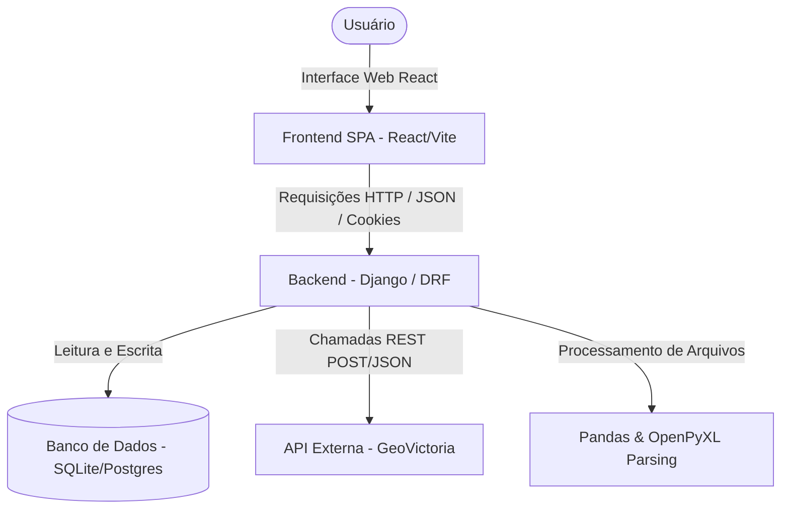
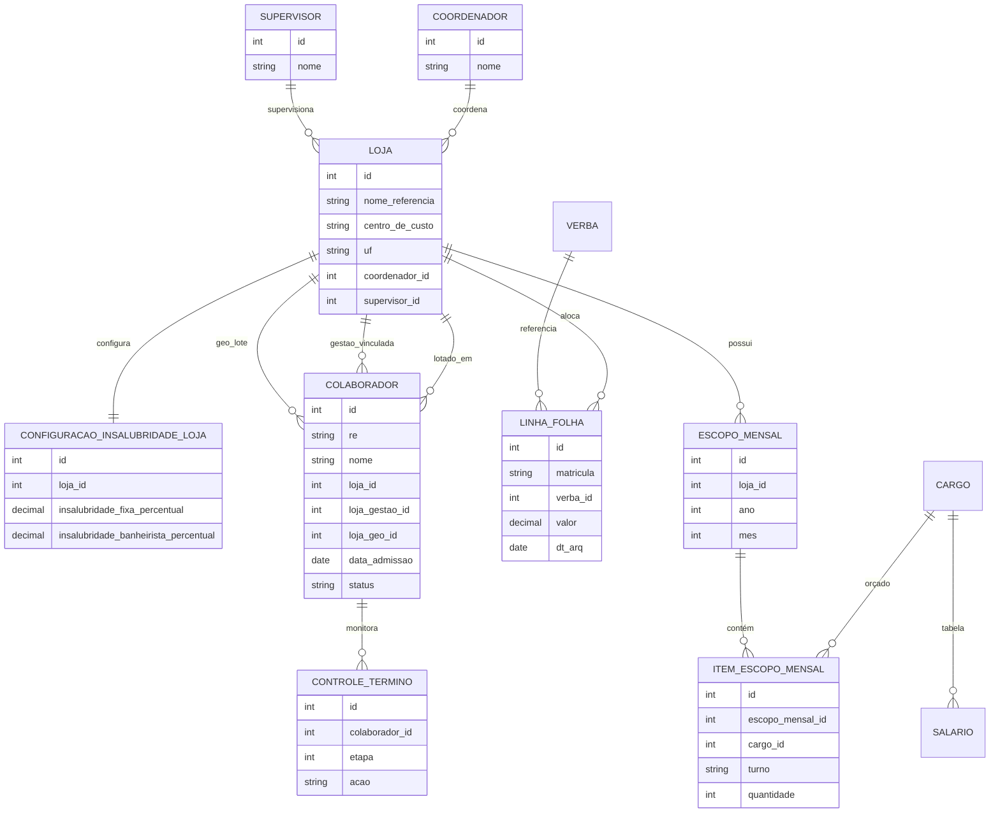

# 📌 Análises Operacionais — Dashboard Corporativo

O **Análises Operacionais** é um sistema corporativo de duas camadas projetado para consolidar e conciliar dados operacionais de colaboradores, escopos de trabalho (quadro planejado) e custos reais de folha de pagamento (SRD). Ele atua como um hub integrador entre o sistema ERP (TOTVS), a planilha de Gestão de Pessoas e o controle de ponto eletrônico (GeoVictoria) para identificar desvios financeiros e operacionais de contratação.

---

## 🏗️ Arquitetura e Fluxo de Dados

O projeto utiliza uma arquitetura baseada em **duas camadas (Decoupled Architecture)**:
1.  **Backend (API REST):** Desenvolvido em Python/Django e Django REST Framework (DRF). Ele centraliza as regras de negócio, a persistência de banco de dados, o processamento de planilhas de grande porte via Pandas/OpenPyXL e a comunicação externa com a GeoVictoria API.
2.  **Frontend (SPA):** Desenvolvido em React (com TypeScript), Vite e TailwindCSS v4. Ele se comunica com o Django consumindo endpoints JSON de forma assíncrona usando Axios.



---

## 🛠️ Stack Tecnológica

### Backend (Django API)
- **Linguagem:** Python 3.14 (compatível com 3.11+)
- **Framework Web:** Django & Django REST Framework (DRF)
- **Processamento de Dados:** Pandas & OpenPyXL (manipulação de planilhas de grande porte de colaboradores e custos de folha)
- **Banco de Dados:** SQLite (para desenvolvimento local) / PostgreSQL (para produção/ambientes em nuvem)

### Frontend (React SPA)
- **Linguagem:** TypeScript
- **Biblioteca Base:** React 19 + Vite (compilação rápida de assets)
- **Estilização:** TailwindCSS v4 (layout fluído e moderno com padrão estético baseado em Shadcn UI)
- **Comunicação:** Axios (cliente HTTP assíncrono integrado com cookies de sessão e CSRF)
- **Componentes Populares:** Lucide React (pacote de ícones), Sonner (sistema de toasts e notificações de interface)

---

## 📂 Módulos e Processos de Negócio

O sistema é dividido em fluxos operacionais bem definidos:

1. **Dashboard Central:** Apresenta indicadores rápidos e cartões de acesso para os colaboradores ativos, demitidos e das filiais cadastrados no sistema.
2. **Cadastro e Configuração de Lojas:**
   - Permite o cadastro e edição de lojas em abas organizadas (Dados Gerais, Endereço, Nome nos Sistemas e Adicional de Insalubridade).
   - Utiliza relacionamentos estruturados (`ForeignKey`) com as tabelas de **Coordenadores** e **Supervisores**.
   - Possui botão de atalho "+" para criação instantânea de coordenadores e supervisores direto na edição da loja.
3. **Controle de Colaboradores & Divergências:**
   - Lista colaboradores vindos do ERP TOTVS (SRA) e aponta inconsistências em relação ao ponto real da GeoVictoria ou à planilha de Gestão de Pessoas.
4. **Términos de Experiência:**
   - Monitora datas de vencimento do 1º e 2º período de experiência de novos funcionários. Permite prorrogações contratuais, download de avisos em lote e filtros avançados.
5. **Central de Importações (Assíncrona):**
   - Upload de arquivos de grande porte (TOTVS SRA, planilha de Gestão de Pessoas e SRD de custos de Folha de Pagamento).
   - O processamento roda em threads de segundo plano (`threading.Thread`), comunicando o progresso percentual via Cache do Django para o React para evitar timeouts HTTP.
   - **Lógica de Conciliação de Custos (SRD):** Filtra as verbas de provento, aloca os custos do funcionário na sua loja de trabalho real (corrigindo rateios errados do ERP) e separa registros duplicados para auditoria na tela.
6. **Escopos de Trabalho:**
   - Definição do quadro de funcionários orçado/planejado por loja, cargo e turno, estimando dinamicamente o custo de salário, adicionais e insalubridade.
7. **Comparativo BI (Orçado vs Real):**
   - Matriz de conciliação financeira que cruza o custo de folha real contra o valor estimado no escopo orçado por rubricas e competências mensais.
8. **Administração de Usuários (CRUD):**
   - Página restrita para usuários com a role `Administrador` que permite o cadastro de novos acessos de analistas, redefinição de senhas e bloqueio/desativação de contas (impedindo o auto-bloqueio do usuário logado).

---

## 🗄️ Modelo de Dados (ER)

Abaixo está o diagrama simplificado de entidades e relacionamentos que formam a base relacional do sistema:



---

## 🔐 Autenticação e Segurança

- **Autenticação por Sessão:** Realizada via cookies HTTP protegidos e gerenciada pelas sessões nativas do Django (`sessionid`).
- **Proteção CSRF:** Integrada nativamente. O Axios captura o token do cookie `csrftoken` e o anexa nas requisições modificadoras (`POST`, `PUT`, `DELETE`) sob o cabeçalho `X-CSRFToken`.
- **Níveis de Permissão:** Separação explícita entre perfis com a role `Administrador` (acesso total e CRUD de usuários) e usuários de consulta operacional.

---

## ⚙️ Instalação e Execução Local

### Pré-requisitos
- Python 3.11+ (Recomendado Python 3.14)
- Node.js 18+ (Recomendado Node 20)

### 1. Backend (Django)
```bash
# Crie e ative o ambiente virtual
python -m venv venv
# No Windows: .\venv\Scripts\activate
# No Linux/Mac: source venv/bin/activate

# Instale as dependências
pip install -r requirements.txt

# Configure o arquivo .env conforme o .env.example
cp .env.example .env

# Rode as migrações e crie o usuário administrador inicial
python manage.py migrate
python manage.py createsuperuser

# Inicie o servidor local (rodará na porta 8000)
python manage.py runserver
```

### 2. Frontend (React)
```bash
cd frontend
npm install
npm run dev
```
O frontend estará acessível em `http://localhost:5173`.

---

## 📈 Roadmap de Próximas Melhorias
- Migração de threads de background para **Celery + Redis** para maior robustez de tarefas longas.
- Otimização do banco de dados relacional com índices para queries de histórico.
- Exibição de gráficos analíticos e painéis de BI interativos no Dashboard React.

---

## 👨‍💻 Guia para Novos Desenvolvedores
*   **Regras de Conciliação:** Localizadas em: [comparativo_loja.py](file:///c:/Users/guilherme.satoru/Desktop/analises-operacionais/lojas/services/comparativo_loja.py).
*   **Importadores de Arquivos:** Localizados em: [views/configuracoes.py](file:///c:/Users/guilherme.satoru/Desktop/analises-operacionais/lojas/views/configuracoes.py).
*   **Ciclo de Experiência (Términos):** Fica em: [views_terminos.py](file:///c:/Users/guilherme.satoru/Desktop/analises-operacionais/colaboradores/views_terminos.py).
