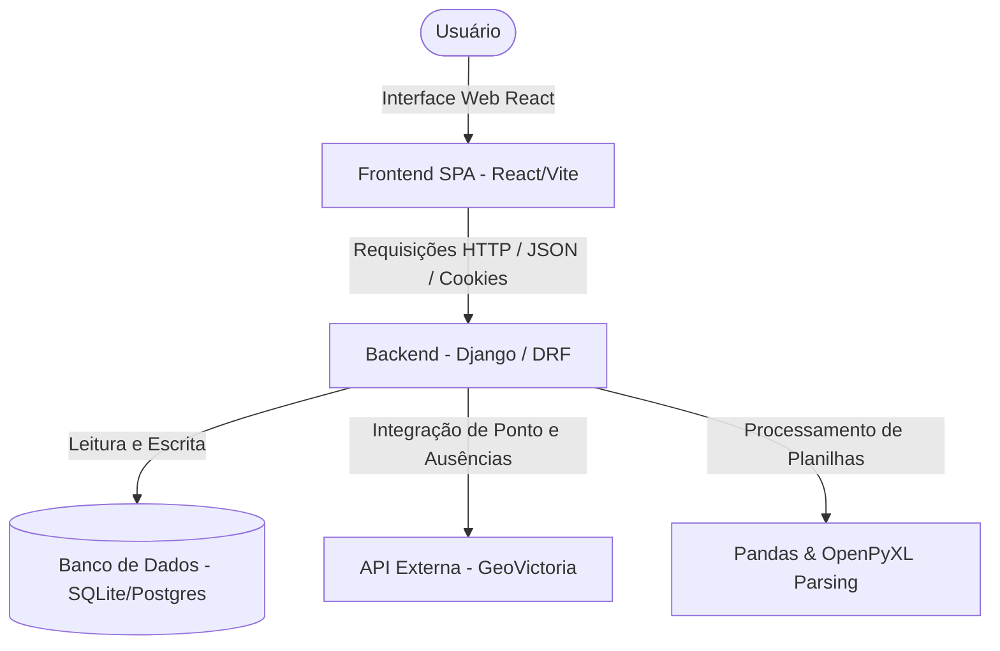
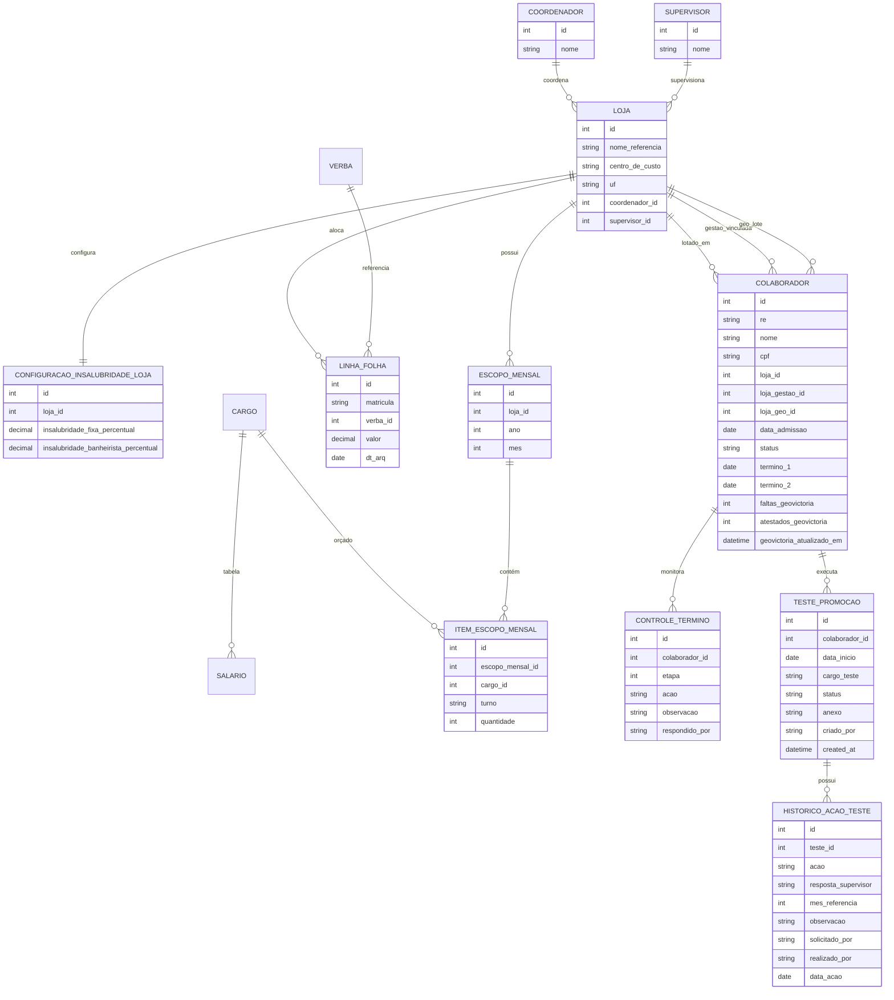

# 📌 Análises Operacionais — Dashboard Corporativo

O **Análises Operacionais** é um sistema corporativo completo de duas camadas projetado para consolidar, processar e conciliar dados operacionais de colaboradores, escopos de trabalho (quadro planejado de pessoal) e custos de folha de pagamento reais (SRD). Ele atua como um hub integrador entre o sistema ERP (TOTVS), as planilhas de Gestão de Pessoas (meta/planejado) e o ponto eletrônico (GeoVictoria API), permitindo ao setor de Recursos Humanos e Financeiro identificar desvios financeiros, operacionais e inconsistências contratuais em tempo real.

---

## 🏗️ Arquitetura e Fluxo de Dados

O projeto utiliza uma arquitetura baseada em **duas camadas independentes (Decoupled SPA/API Architecture)**:
1.  **Backend (API REST):** Desenvolvido em Python/Django e Django REST Framework (DRF). É responsável pela persistência das regras de negócio, administração do banco de dados, comunicação assíncrona com a GeoVictoria API, processamento robusto de arquivos via Pandas e conciliação de dados.
2.  **Frontend (SPA):** Desenvolvido em React, TypeScript, Vite e estilizado com TailwindCSS v4 e padrões estéticos modernos baseados no Shadcn UI. Ele se comunica com o Django consumindo endpoints JSON assincronamente através do Axios.



---

## 🛠️ Stack Tecnológica

### Backend (Django API)
- **Linguagem:** Python 3.11+ (Recomendado Python 3.14)
- **Framework Web:** Django & Django REST Framework (DRF)
- **Processamento de Dados:** Pandas & OpenPyXL (manipulação de planilhas de grande porte)
- **Banco de Dados:** SQLite (padrão para desenvolvimento local) / PostgreSQL (suportado para produção/ambientes em nuvem)
- **Servidor Web:** Gunicorn / Uvicorn / Waitress

### Frontend (React SPA)
- **Linguagem:** TypeScript
- **Biblioteca Base:** React 19 + Vite (compilação rápida de assets)
- **Estilização:** TailwindCSS v4 (layout fluído e moderno com padrão baseado em Shadcn UI)
- **Comunicação:** Axios (cliente HTTP assíncrono integrado com cookies de sessão e proteção CSRF)
- **Componentes:** Lucide React (ícones), Recharts (gráficos analíticos de prêmios), Sonner (sistema de toasts e notificações de interface)

---

## 📂 Módulos e Processos de Negócio

O sistema é estruturado em fluxos operacionais bem definidos e telas ricas no frontend:

### 1. Dashboard Central
*   **Finalidade:** Exibe uma visão macro e analítica dos principais indicadores da empresa.
*   **Funcionalidades:** Apresenta indicadores rápidos e cartões de acesso dinâmicos para controle de colaboradores ativos, demitidos e filiais cadastradas no sistema.
*   **Arquivo de Entrada:** [Dashboard.tsx](file:///c:/Users/guilherme.satoru/Desktop/analises-operacionais/frontend/src/pages/Dashboard.tsx)

### 2. Cadastro e Configuração de Lojas
*   **Finalidade:** Centraliza a gestão de todas as filiais e suas configurações financeiras.
*   **Funcionalidades:** 
    - Organizado em abas claras: Dados Gerais, Endereço, Nome nos Sistemas e Adicional de Insalubridade.
    - Relacionamento estruturado (`ForeignKey`) com as tabelas de **Coordenadores** e **Supervisores**.
    - Permite criação instantânea de coordenadores e supervisores por meio de botões de atalho "+" na própria tela de edição da loja.
*   **Componentes Chave:** [Lojas.tsx](file:///c:/Users/guilherme.satoru/Desktop/analises-operacionais/frontend/src/pages/Lojas.tsx) e o modelo [models.py (Lojas)](file:///c:/Users/guilherme.satoru/Desktop/analises-operacionais/lojas/models.py).

### 3. Controle de Colaboradores & Divergências
*   **Finalidade:** Mapear o headcount real de funcionários e identificar divergências cadastrais.
*   **Funcionalidades:**
    - Lista colaboradores provenientes do ERP TOTVS (SRA).
    - Aponta de forma clara inconsistências cadastrais e divergências físicas entre as bases (como divergências de lotação real vs sistema, ou funcionários que não batem ponto).
*   **Arquivo de Entrada:** [Colaboradores.tsx](file:///c:/Users/guilherme.satoru/Desktop/analises-operacionais/frontend/src/pages/Colaboradores.tsx)

### 4. Términos de Experiência
*   **Finalidade:** Monitorar o ciclo inicial de experiência dos colaboradores para apoiar decisões de contratação definitiva ou rescisão contratual.
*   **Fluxo de Regra de Negócio:**
    - **Prazos:** Calcula e monitora automaticamente o vencimento do 1º período (geralmente 45 dias) e do 2º período (geralmente 90 dias) de experiência com base na data de admissão.
    - **Etapas e Decisões:**
        - **Etapa 1:** Permite as ações de `Prorrogado` (avança o funcionário para a Etapa 2), `Manter` (efetiva o colaborador) ou `Termino` (rescisão).
        - **Etapa 2:** Permite apenas `Manter` (efetiva o colaborador) ou `Termino` (rescisão).
    - **Tolerância por Decurso de Prazo:** Há uma regra automática de expiração (descarte) em que o colaborador é removido da listagem de acompanhamento caso passem mais de **10 dias** do término do período correspondente sem nenhuma decisão registrada pela gestão.
    - **Integração GeoVictoria (Dados de Ponto):** Apresenta o número consolidado de faltas e atestados acumulados nos últimos 12 meses (ou a partir de sua admissão) e disponibiliza um detalhamento diário de ocorrências diretamente no modal de decisão para auxiliar o RH.
    - **Reversão:** Permite a exclusão de uma decisão tomada anteriormente (DELETE), retornando o funcionário para a situação pendente correspondente.
*   **Arquivos Relacionados:** [views_terminos.py](file:///c:/Users/guilherme.satoru/Desktop/analises-operacionais/colaboradores/views_terminos.py) e [Terminos.tsx](file:///c:/Users/guilherme.satoru/Desktop/analises-operacionais/frontend/src/pages/Terminos.tsx)

### 5. Testes de Promoção
*   **Finalidade:** Gerenciar e registrar o fluxo de teste operacional de colaboradores indicados para promoção de cargo.
*   **Fluxo de Regra de Negócio (Acompanhamento Mensal de até 4 Meses):**
    - **Cadastro Inicial:** Exige obrigatoriamente o preenchimento da data de início, o cargo de teste e o upload da folha de teste assinada (anexo físico). Inicia no status `Pendente`.
    - **Aprovação:** O teste deve ser aprovado pela gestão (coordenador), passando para o status `Ativo`.
    - **Ciclo Mensal de Controle (Mês 1 a 4):** A cada mês de teste ativo, ocorrem duas etapas consecutivas:
        1.  **Etapa de Resposta do Supervisor (`registrar_resposta`):** O supervisor da filial avalia o desempenho do colaborador e escolhe uma opção: `Pagar Prêmio`, `Promover` ou `Cancelar`.
            - *No Mês 1:* A resposta deve ser obrigatoriamente `Pagar Prêmio` (não é permitido promover).
            - *No Mês 4:* A resposta não pode ser `Pagar Prêmio` (deve ser a decisão final de `Promover` ou `Cancelar`).
        2.  **Etapa de Confirmação de Ação (Ação Final):** A gestão analisa a resposta do supervisor e executa a ação correspondente no sistema.
    - **Finalização:** Ao aplicar a ação final de `Promover` ou `Cancelar`, o status geral do teste muda para `promovido` ou `cancelado`, encerrando o fluxo.
    - **Auditoria:** Todas as ações, respostas dos supervisores, datas e observações são registradas em um histórico cronológico visível na tela.
*   **Arquivos Relacionados:** [views_testes.py](file:///c:/Users/guilherme.satoru/Desktop/analises-operacionais/colaboradores/views_testes.py) e [TestesPromocao.tsx](file:///c:/Users/guilherme.satoru/Desktop/analises-operacionais/frontend/src/pages/TestesPromocao.tsx)

### 6. Central de Importações (Processamento Assíncrono)
*   **Finalidade:** Receber e consolidar arquivos de dados pesados sem travar a interface do usuário.
*   **Mecanismo Técnico:** 
    - O upload do arquivo dispara uma tarefa assíncrona executada em uma thread em segundo plano (`threading.Thread`).
    - O progresso do processamento (de 0% a 100%) é gravado periodicamente no **Cache do Django** e consumido pelo React via polling HTTP, evitando timeouts do servidor web.
*   **Lógica de Rateio e Conciliação de Custos (SRD):**
    - Identifica as verbas de provento, aloca os custos do funcionário na sua loja de trabalho física real (corrigindo rateios errados vindos do ERP) e separa duplicidades para auditoria financeira.
*   **Arquivos Suportados:**
    1.  **TOTVS SRA (Colaboradores):** Arquivo CSV com dados demográficos e cadastrais do ERP.
    2.  **Gestão de Pessoas (Metas):** Planilha Excel (.xlsx, .xlsm) com o quadro planejado de colaboradores e metas.
    3.  **Folha de Pagamento SRD (Custos Reais):** Arquivo CSV com a folha de pagamento detalhada por rubricas.
    4.  **Diárias (Unificada):** Importa em conjunto a Base de Diárias do Sistema (CSV) e a Base Manual (Excel).
    5.  **Prêmios (Unificada):** Importa a Base de Prêmios do Sistema (Excel) e a Base Manual (Excel) de um período (Mês/Ano) informado.
*   **Arquivos Relacionados:** [configuracoes.py](file:///c:/Users/guilherme.satoru/Desktop/analises-operacionais/lojas/views/configuracoes.py) e [Importacoes.tsx](file:///c:/Users/guilherme.satoru/Desktop/analises-operacionais/frontend/src/pages/Importacoes.tsx)

### 7. Escopos de Trabalho
*   **Finalidade:** Gestão do quadro orçado de funcionários por filial.
*   **Funcionalidades:**
    - Define a meta planejado de quantidade de funcionários por cargo e turno para cada loja.
    - Calcula dinamicamente o custo financeiro projetado com base em tabelas de salários, adicionais de insalubridade e benefícios por cargo.
*   **Arquivo de Entrada:** [Escopos.tsx](file:///c:/Users/guilherme.satoru/Desktop/analises-operacionais/frontend/src/pages/Escopos.tsx)

### 8. Comparativo BI (Orçado vs Real)
*   **Finalidade:** Fornecer uma matriz financeira comparativa (BI) para controle orçamentário.
*   **Funcionalidades:** Cruza o custo de pessoal orçado (definido nos escopos) contra o custo real efetivamente pago (importado na folha de pagamento SRD), detalhando desvios de despesas por competência e rubricas.
*   **Arquivos Relacionados:** [comparativo_loja.py](file:///c:/Users/guilherme.satoru/Desktop/analises-operacionais/lojas/services/comparativo_loja.py) e [Comparativo.tsx](file:///c:/Users/guilherme.satoru/Desktop/analises-operacionais/frontend/src/pages/Comparativo.tsx)

### 9. Administração de Usuários
*   **Finalidade:** Cadastro e controle de permissões de acesso ao sistema.
*   **Funcionalidades:**
    - Permite que usuários do perfil `Administrador` gerenciem os acessos de analistas (`Consulta` e `Gestão`).
    - Oferece suporte a redefinição de senhas, ativação/bloqueio de contas e possui proteção contra o auto-bloqueio (impedindo que o usuário atual logado desative a si próprio).
*   **Arquivo de Entrada:** [Usuarios.tsx](file:///c:/Users/guilherme.satoru/Desktop/analises-operacionais/frontend/src/pages/Usuarios.tsx)

---

## 🗄️ Modelo de Dados (ER)

Abaixo está o mapeamento dos relacionamentos principais das tabelas que estruturam as regras de negócio do sistema:



---

## 🔐 Autenticação e Segurança

-   **Autenticação por Sessão:** Utiliza o mecanismo nativo do Django (`sessionid`) em cookies HTTP com flags de proteção.
-   **Segurança CSRF:** O frontend React lê o token do cookie `csrftoken` e o anexa automaticamente no cabeçalho `X-CSRFToken` em requisições de escrita (`POST`, `PUT`, `DELETE`), prevenindo ataques Cross-Site Request Forgery.
-   **Níveis de Acesso (RBAC):**
    -   `Administrador`: Controle total do sistema, importações confidenciais, CRUD de usuários.
    -   `Gestão`: Acesso a colaboradores, visualização de escopos, tomada de decisões em termos e testes.
    -   `Consulta`: Acesso de leitura para monitoramento e análise de dashboards.

---

## ⚙️ Instalação e Execução Local

### Pré-requisitos
-   **Python 3.11+** (Recomendado Python 3.14)
-   **Node.js 18+** (Recomendado Node 20)
-   **Git** (para controle de versão)

---

### 1. Instalação e Execução do Backend (Django API)

No diretório raiz do projeto:

```bash
# 1. Crie o ambiente virtual (venv)
python -m venv venv

# 2. Ative o ambiente virtual
# No Windows (PowerShell):
.\venv\Scripts\Activate.ps1
# No Windows (CMD):
.\venv\Scripts\activate.bat
# No Linux/Mac:
source venv/bin/activate

# 3. Instale as dependências requeridas
pip install -r requirements.txt

# 4. Crie o arquivo de configurações de variáveis de ambiente (.env)
# Copie as variáveis padrão a partir do .env.example
cp .env.example .env

# 5. Execute as migrações iniciais do banco de dados
python manage.py migrate

# 6. Crie o usuário Administrador inicial do sistema
python manage.py createsuperuser

# 7. Inicie o servidor local do Django (rodando por padrão na porta 8000)
python manage.py runserver
```

*O backend estará rodando em `http://localhost:8000`.*

---

### 2. Instalação e Execução do Frontend (React SPA)

No diretório `frontend`:

```bash
# 1. Navegue até a pasta do frontend
cd frontend

# 2. Instale as dependências declaradas no package.json
npm install

# 3. Inicialize o servidor de desenvolvimento do Vite
npm run dev
```

*O frontend estará rodando em `http://localhost:5173`.*

---

### 3. Execução Simplificada via Docker Compose

Caso prefira rodar toda a aplicação via Docker (isolando o ambiente), execute no diretório raiz:

```bash
# Constrói as imagens locais e inicializa os containers do backend e frontend
docker compose up --build
```

O compose utilizará as portas:
*   **Backend:** `http://localhost:8000`
*   **Frontend:** `http://localhost:5173`

---

## 👨‍💻 Guia para Novos Desenvolvedores

### 📍 Localização de Regras de Negócio e Serviços
*   **Integrações e Consolidadores da GeoVictoria:** Localizado em [geovictoria_sync.py](file:///c:/Users/guilherme.satoru/Desktop/analises-operacionais/colaboradores/services/geovictoria_sync.py) e no cliente HTTP [geovictoria.py](file:///c:/Users/guilherme.satoru/Desktop/analises-operacionais/colaboradores/services/geovictoria.py).
*   **Processamento da Folha SRD:** Localizado em [folha_importacao.py](file:///c:/Users/guilherme.satoru/Desktop/analises-operacionais/lojas/services/folha_importacao.py).
*   **Regras do Comparativo Financeiro:** Localizado em [comparativo_loja.py](file:///c:/Users/guilherme.satoru/Desktop/analises-operacionais/lojas/services/comparativo_loja.py).
*   **Lógica de Negócio de Términos:** Encontra-se em [views_terminos.py](file:///c:/Users/guilherme.satoru/Desktop/analises-operacionais/colaboradores/views_terminos.py) e [view_utils.py](file:///c:/Users/guilherme.satoru/Desktop/analises-operacionais/colaboradores/view_utils.py).
*   **Lógica de Negócio de Testes de Promoção:** Encontra-se em [views_testes.py](file:///c:/Users/guilherme.satoru/Desktop/analises-operacionais/colaboradores/views_testes.py).

### 📐 Diretrizes e Limitações Arquiteturais do Frontend
Para manter o frontend limpo, modularizado e com excelente desempenho, os desenvolvedores devem aderir rigorosamente às seguintes diretrizes de design de código:

1.  **Decomposição de Componentes Grandes (Single Responsibility Principle - SRP):**
    -   Arquivos de componentes e páginas não devem ultrapassar **350-400 linhas de código**.
    -   Se uma página ou modal se tornar muito complexa, decomponha-a em subcomponentes e agrupe-os em pastas dedicadas.
    -   *Exemplo:* O modal de termos de experiência é quebrado em [DecisaoTerminoModal.tsx](file:///c:/Users/guilherme.satoru/Desktop/analises-operacionais/frontend/src/components/Terminos/DecisaoTerminoModal.tsx) (orquestrador principal), [DecisaoTab.tsx](file:///c:/Users/guilherme.satoru/Desktop/analises-operacionais/frontend/src/components/Terminos/DecisaoTab.tsx) (formulário), [AusenciasTab.tsx](file:///c:/Users/guilherme.satoru/Desktop/analises-operacionais/frontend/src/components/Terminos/AusenciasTab.tsx) (dados do ponto) e [ConfirmDeleteModal.tsx](file:///c:/Users/guilherme.satoru/Desktop/analises-operacionais/frontend/src/components/Terminos/ConfirmDeleteModal.tsx) (confirmação).
2.  **Separação de Preocupações (Estilos e Lógica):**
    -   Utilize apenas classes utilitárias do TailwindCSS para a interface. **Nunca** utilize estilos inline no React (`style={{ ... }}`).
    -   Isole operações de chamadas de API e manipulação de formulários em hooks ou subcomponentes para manter o JSX das páginas leve.
3.  **Reusabilidade de Formatações:**
    -   Evite declarar funções locais de formatação em múltiplos arquivos. Use os formatadores globais definidos em [formatters.ts](file:///c:/Users/guilherme.satoru/Desktop/analises-operacionais/frontend/src/utils/formatters.ts) (como `formatCurrency` e `formatDate`).
4.  **Auto-Documentação:**
    -   Docstrings ou comentários explicativos dentro do código do frontend ou backend devem estar escritos em **Português**, justificando **o porquê (WHY)** de o código ou regra existir naquele formato.
